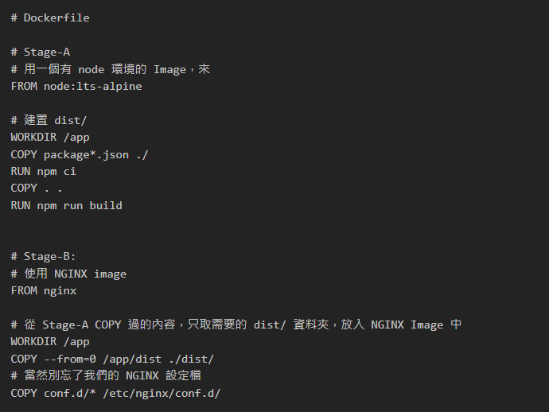
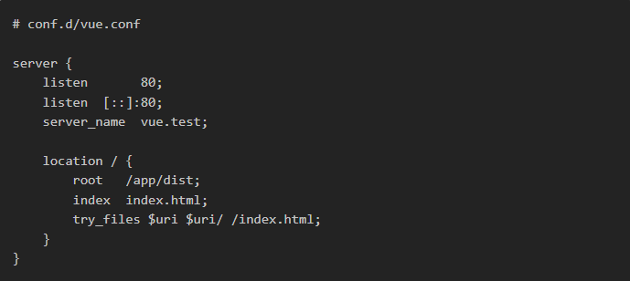
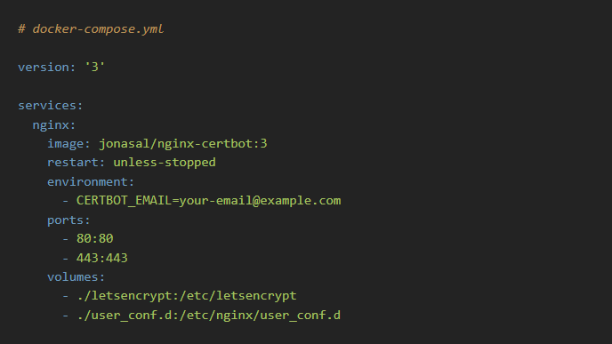
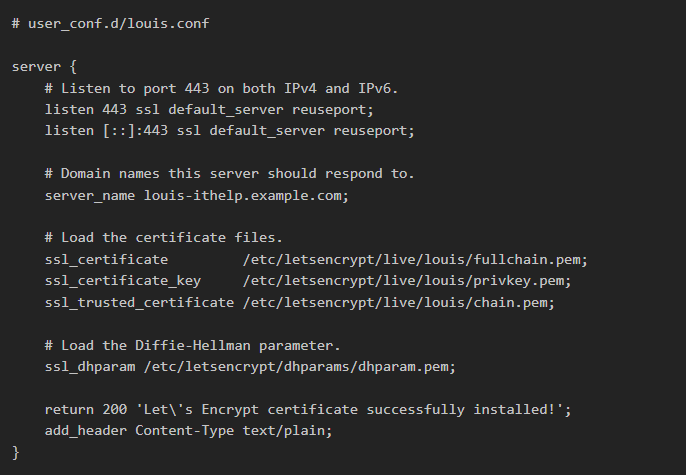

# Roadmap

VM 共享的是硬體，創造出虛擬的 OS；Docker 則是共享 OS，創造出虛擬的執行環境。


# Image Layer

每個步驟會生成一個新的 Layer（層），而不同的 Image 之間可能會有部分 Layer 的內容是相同的。  
為了節省儲存空間，`Docker` 會共用相同的 Layer，而不是為每個 Image 儲存重複的內容。


# Build Cache

為了提升建置速度，`Docker` 提供了 Build Cache 機制，重複使用已經生成的 Layer，避免每次建置都重新執行相同的指令。  
透過 `--cache-from` 參數，可以指定使用的 Cache 來源，進一步提升建置效能。


### 使用 `--cache-from`

在建置 Image 時，可以使用以下指令啟用 Cache：

```bash
$ sudo docker build . -t hello-world-server --cache-from another-server
```

# Docker Engine

`Docker` 的運作環境可以概括為三層結構：

1. `CLI（Command Line Interface）`
   使用者透過 CLI 發送指令，觸發相關功能。

2. `Client 與 Daemon 通信`  
   CLI 將指令傳遞給 Docker Client，Client 隨後向 Docker Daemon 發送請求，要求執行具體操作。

3. `Daemon 與核心模組交互`  
   Docker Daemon 接收到請求後，進一步與系統核心的 Docker 模組（Kernel）進行交互，完成最終的容器管理工作。

# Volume

Volume 是用來將 `Docker` 容器內的檔案與外部路徑綁定，確保資料的持久化和隔離,用冒號 `:` 分隔開，前者是主機本身的路徑，後者是容器內的路徑。

### 使用 `--volume`

可以在 docker run 指令中透過 `--volume` 參數來綁定路徑

```bash
$ sudo docker run --volume <host_path>:<container_path> <image_name>
```

# PostgresSQL Image

1. `--publish (-p)`: PostgreSQL 預設使用 Port 5432，我們把這個 Port 對外連結到 Server 的 Port 5432。

2. `--env (-e)` : PostgreSQL 需要讀取初始的設定值，因此在啟動 Container 時帶入環境變數。

3. `--volume (-v)` : 為了避免在 Container 被移除後，資料庫的資料也一併被刪除，我們將資料庫的儲存路徑連結到 Server 的指定位置上。

4. `--detach (-d)` : 在背景持續執行。

```bash
$ sudo docker run \
    --publish 5432:5432 \
    --env POSTGRES_PASSWORD=password\
    --env POSTGRES_USER=user\
    --env POSTGRES_DB=database \
    --volume /root/postgres:/var/lib/postgresql/data \
    --name postgres \
    --detach \
    postgres:latest
```

# NGINX Image

`NGINX` 是業界廣泛使用的 Web 伺服器，主要用途是將進入伺服器的請求（Request）轉發給指定的服務進行處理，更進階的功能還包括負載平衡（Load Balancing）。

### 使用自定義配置

在主機上創建或修改 `conf.d/` 目錄中的配置文件後，NGINX 容器啟動時會自動加載並生效。


### 使用 Docker Compose 管理

使用 Volume 將當前目錄的`conf.d/` 綁定到容器內的 `/etc/nginx/conf.d`，實現配置文件的共享和管理。  


# Multi-Stage Builds
使用`Multi-Stage Builds` 減少 `Docker` 映像大小，改善構建流程的可讀性與可維護性。


### Stage-A：構建階段
利用 Node.js 環境構建應用程式，生成靜態文件存放於 dist/ 目錄。
### Stage-B：部署階段
使用 NGINX 作為靜態文件伺服器，並將構建階段的靜態文件複製進來。
## NGINX Config
用於將靜態文件部署在 vue.test 域名上，並支援 URL 重寫。



# Certbot

`Let's Encrypt` 提供免費的憑證申請服務，但前提是您必須擁有相關的網域。
`Certbot` 是一款能夠自動化處理憑證申請的工具，它可以自動讀取 `NGINX` 的設定檔，檢索設定的網域後，向 `Let's Encrypt`申請對應的憑證。
此外，`Certbot` 還能自動檢測憑證的有效期限，並在必要時自動更新，確保服務不中斷。

### jonasal/nginx-certbot Image

`jonasal/nginx-certbot` 是一個結合 `NGINX` 和 `Certbot` 的 `Docker` 映像檔，雖然不是官方提供，但仍擁有相當高的使用量。
透過這個映像檔，我們可以在使用 `Docker` 架設 `NGINX` 的同時，輕鬆完成 `HTTPS` 的設定，大幅簡化網站部署流程。


`CERTBOT_EMAIL` 是必填的環境變數，用於 `Certbot` 傳送重要通知至指定的電子郵件信箱。

Port 的部分，由於需要將所有來自 80 的流量導向 443（HTTPS 的預設 Port），因此這兩個 Port 必須同時開放。

Volume 綁定則設置了兩個目錄：

1. `letsencrypt/`：用於存儲 `SSL` 憑證檔案。
2. `user_conf.d/`：這是 `nginx-certbot` 映像檔特別定義的目錄，用來存放自訂的 `NGINX` 設定檔。


在 `NGINX` 設定檔中，將 `louis-ithelp.example.com` 替換為您擁有的實際網域名稱，以確保伺服器能正確回應對應的請求。

